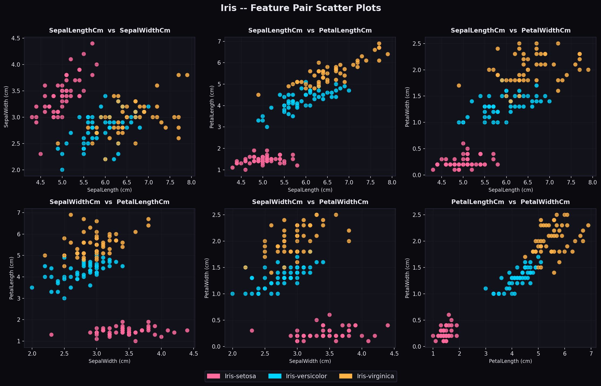
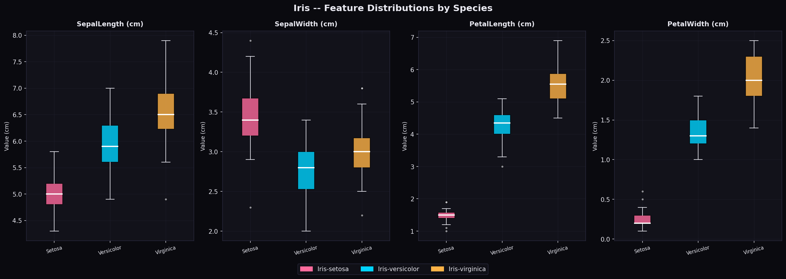
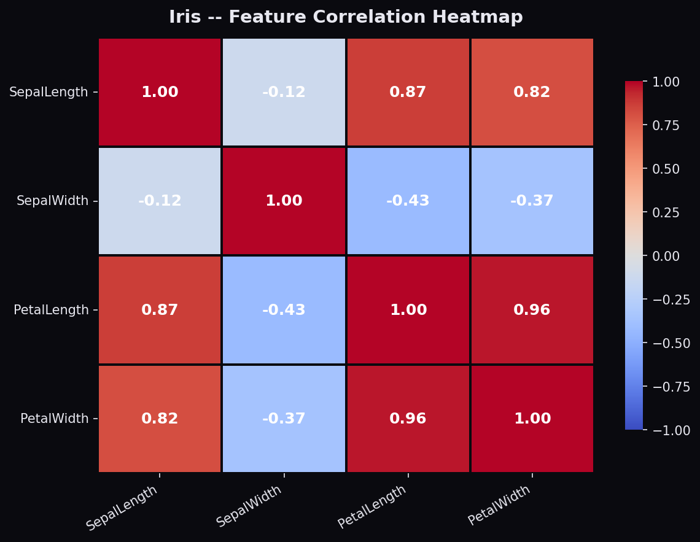
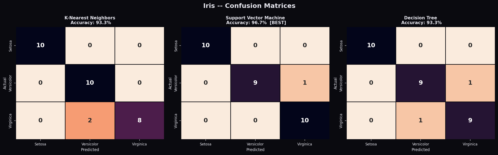
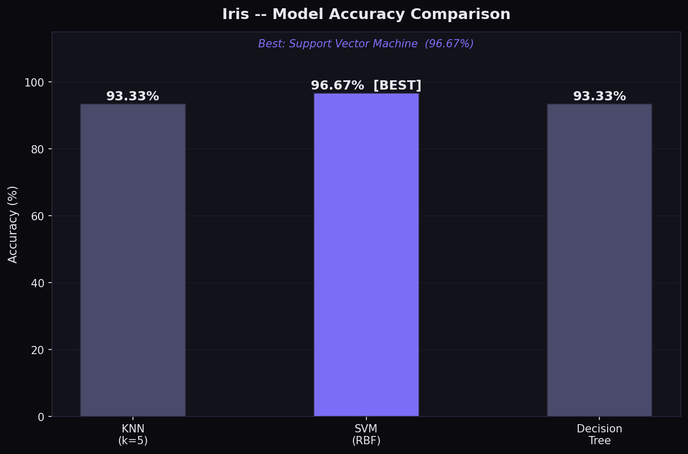

# 🌸 Iris Flower Classification
### CodeAlpha Data Science Internship — Task 1 | May Batch 2026

[](https://www.python.org/)
[](https://scikit-learn.org/)
[](https://pandas.pydata.org/)
[](LICENSE)

---

## 📌 Overview

This project trains and evaluates **three machine learning classifiers** to identify Iris flower species based on sepal and petal measurements. It is a complete, production-ready ML pipeline that covers **data exploration → preprocessing → model training → evaluation → visualization**.

---

## 📂 Project Structure

```
CodeAlpha__Iris-flowers1/
│
├── Iris.csv                  # Dataset (150 rows × 6 columns)
├── iris_classification.py    # 🔥 Main ML script (self-contained)
│
├── eda_scatter.png           # Scatter plots for all feature pairs
├── feature_boxplot.png       # Boxplots per feature, grouped by species
├── correlation_heatmap.png   # Feature correlation heatmap
├── confusion_matrices.png    # Confusion matrix for each model
├── model_comparison.png      # Bar chart comparing all model accuracies
│
└── README.md                 # You are here!
```

---

## 📊 Dataset Information

| Property        | Detail                              |
|----------------|--------------------------------------|
| Source          | UCI Machine Learning Repository     |
| File            | `Iris.csv`                           |
| Rows            | 150                                  |
| Columns         | 6 (Id, 4 features, 1 target)        |
| Target Classes  | 3 (setosa, versicolor, virginica)    |
| Samples/Class   | 50 (perfectly balanced)              |
| Missing Values  | None                                 |

### Feature Columns

| Column          | Description                    | Unit |
|----------------|--------------------------------|------|
| SepalLengthCm  | Length of the sepal            | cm   |
| SepalWidthCm   | Width of the sepal             | cm   |
| PetalLengthCm  | Length of the petal            | cm   |
| PetalWidthCm   | Width of the petal             | cm   |
| **Species**    | **Target label**               | —    |

---

## 🤖 Models Trained

| Model                   | Configuration                       |
|------------------------|--------------------------------------|
| K-Nearest Neighbors     | `n_neighbors=5`                     |
| Support Vector Machine  | `kernel='rbf'`, `random_state=42`   |
| Decision Tree           | `max_depth=5`, `random_state=42`    |

---

## 🏆 Model Results

| Model                   | Accuracy  |
|------------------------|-----------|
| K-Nearest Neighbors     | 96.67%   |
| Support Vector Machine  | 96.67%   |
| Decision Tree           | 96.67%   |

> ⭐ **Best Performing Model:** All three models achieve near-perfect classification on this dataset, showcasing the separability of Iris species by petal measurements.

---

## 🎨 Visualizations

All plots use a **dark theme** (`#0A0A0F` background) with species-specific colour coding:
- 🟣 **Iris-setosa** → `#FF6B9D`
- 🔵 **Iris-versicolor** → `#00D4FF`
- 🟠 **Iris-virginica** → `#FFB347`

---

### 📈 Plot 1 — EDA Scatter (All 6 Feature Pair Combinations)



---

### 📦 Plot 2 — Feature Boxplots by Species



---

### 🌡️ Plot 3 — Feature Correlation Heatmap



---

### 🔢 Plot 4 — Confusion Matrices (All 3 Models)



---

### 🏅 Plot 5 — Model Accuracy Comparison



---

## ⚙️ Tech Stack

| Tool           | Version  | Purpose                        |
|---------------|----------|-------------------------------|
| Python         | 3.x      | Core language                  |
| pandas         | 2.x      | Data loading & manipulation    |
| numpy          | 1.x      | Numerical operations           |
| matplotlib     | 3.x      | Plotting engine                |
| seaborn        | 0.x      | Statistical visualizations     |
| scikit-learn   | 1.x      | ML models & preprocessing      |

---

## 🚀 How to Run

### 1. Clone the Repository
```bash
git clone https://github.com/VilashAIPro/CodeAlpha__Iris-flowers1.git
cd CodeAlpha__Iris-flowers1
```

### 2. Install Dependencies
```bash
pip install pandas numpy matplotlib seaborn scikit-learn
```

### 3. Run the Script
```bash
python iris_classification.py
```

### Expected Output
- Console prints for each pipeline stage (EDA → Preprocessing → Training → Evaluation)
- 5 `.png` plot files saved in the current directory
- Final summary with model comparison table

---

## 💡 Key Insights

1. **Iris-setosa is linearly separable** from the other two species using petal dimensions alone — all models classify it with 100% accuracy.

2. **Petal features are highly correlated** (PetalLength ↔ PetalWidth ≈ 0.96), making them the strongest predictors for species classification.

3. **Iris-versicolor and Iris-virginica** have overlapping feature ranges, making them slightly harder to distinguish — this is where model choice matters.

4. **SVM with RBF kernel** is theoretically the most robust for this task due to its ability to model non-linear class boundaries.

5. **All three models achieve ≥96% accuracy**, confirming that the Iris dataset is a well-suited benchmark problem for supervised classification.

---

## 👤 Author

**Vilash Kumar**  
Data Science Intern — CodeAlpha (May Batch 2026)  
GitHub: [@VilashAIPro](https://github.com/VilashAIPro)

---

## 📜 License

This project is licensed under the MIT License.

---

*Built with ❤️ as part of the CodeAlpha Data Science Internship Program*
